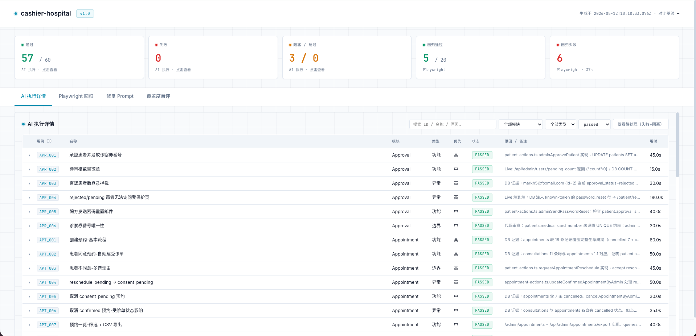

# doc2test

> PRD-driven, AI-powered UI automation testing Skill — works with both **Claude Code** and **Codex CLI**.

[中文](./README.md) | English

One Skill, four stages, covering the full loop from "read the PRD" to "run the cases" to "build a regression suite":

1. **Design** — Read the PRD and generate a structured test outline and cases under `test/{version}/` (with PRD snapshot and version diff).
2. **Execute** — Run cases in a real browser via `chrome-devtools-mcp`, capturing screenshots, console output, and network errors per case.
3. **Extract** — Promote stable, deterministic flows into Playwright scripts, building a regression suite reusable across versions.
4. **Regress + Report** — Run Playwright and merge the AI execution results with Playwright results into a unified HTML dashboard.

For the full rules and invariants, see [SKILL.md](./SKILL.md); for case design conventions, see [role.md](./role.md).

---

## What the report looks like

Every doc2test run produces a self-contained HTML dashboard that merges AI execution details, Playwright regression results, coverage self-eval, and a fix prompt into a single page — just `open test/{version}/report/index.html`.



The five cards on top summarize AI passed / failed / blocked-or-skipped / Playwright passed / Playwright failed. The tabs below let you filter the 60 cases by module, type, and status; each row expands to show `steps.md`, screenshots, and failure context. Blocked cases display two actionable lines: "why it's stuck" and "what to do next".

---

## Installation

### Claude Code

**Global install (recommended)** — available across all projects:

```bash
git clone https://github.com/marktyo/doc2test.git ~/.claude/skills/doc2test
```

**Project-level install** — available only in the current project, travels with the repo:

```bash
# from your project root
git submodule add https://github.com/marktyo/doc2test.git .claude/skills/doc2test
```

**Via the plugin marketplace (optional)** — best for teams that want versioning and one-click updates:

```text
/plugin marketplace add marktyo/doc2test
/plugin install doc2test
```

### Codex CLI

**Global install:**

```bash
git clone https://github.com/marktyo/doc2test.git ~/.codex/skills/doc2test
```

**Project-level install:**

```bash
git submodule add https://github.com/marktyo/doc2test.git .codex/skills/doc2test
```

### Sharing across both clients

If you use both Claude Code and Codex on the same machine, clone once to a neutral location and symlink into both skills directories:

```bash
git clone https://github.com/marktyo/doc2test.git ~/skills/doc2test
ln -s ~/skills/doc2test ~/.claude/skills/doc2test
ln -s ~/skills/doc2test ~/.codex/skills/doc2test
```

A single `git pull` upgrades both clients.

---

## Quick start

1. Go to your Web project root.
2. In Claude Code, type:

   ```text
   /doc2test
   ```

   Or in Codex:

   ```text
   Run doc2test, version v1.0
   ```

3. The Skill will walk you through generating `test/.skill-config.yaml`, confirming the PRD path, app URL, auth modes, module mapping, etc.
4. It then runs the four stages in order, reporting back at each boundary so you can interrupt or redirect at any point.

Final layout:

```text
test/
├── .skill-config.yaml          ← project-level skill config
├── accounts.md                 ← test accounts (gitignored)
├── v1.0/
│   ├── test-outline.md
│   ├── test-cases.md
│   ├── prd-snapshot.md
│   ├── prd-diff.md             ← iteration versions only
│   ├── ORD_001/                ← one folder per case
│   │   ├── meta.json
│   │   ├── steps.md
│   │   ├── screenshots/
│   │   └── console.log
│   └── report/
│       └── index.html          ← unified HTML report
└── playwright/                 ← regression suite shared across versions
    ├── playwright.config.ts
    ├── fixtures/
    └── specs/{domain}/{feature}.spec.ts
```

---

## FAQ

### Q1: What does the version iteration flow look like?

The first version pays a one-time full cost; subsequent iterations only pay for what changed — the Playwright suite accumulates across versions and gets cheaper over time.

| Version | Stage 1 Design | Stage 2 AI execution | Stage 3 Extract | Stage 4 Regression + Report |
|---|---|---|---|---|
| **v1.0 initial** | Generate 47 cases, all `pending` | AI serial run 47/47 (~90 min) | Promote the 30 `extract + passed` cases to Playwright specs | AI report + first full Playwright regression |
| **v1.1 iteration** | Diff against v1.0 prd-snapshot: `unchanged 38 / modified 3 / new 8 / removed 0` | AI runs only `modified + new`, 11 cases (~22 min) | Incrementally update Playwright specs (edit 3 / add 8) | `unchanged 38` covered by parallel Playwright; AI + Playwright merged report |

**Core mechanism:**

- `prd-snapshot.md` is the diff anchor between versions — v1.0 writes the snapshot, v1.1 classifies cases against it
- The Playwright suite **accumulates across versions**, only growing in Stage 3, never sliced per version; every regression runs the full suite
- The iteration savings come from `unchanged` cases consuming zero AI time while still being covered by parallel Playwright

### Q2: Is Stage 2 (Execute) serial? Can cases run in parallel?

**Currently serial** — one case at a time. Three root constraints:

- LLMs reason sequentially. Tool calls can be parallelized, but the "look at screenshot → judge → decide next step" loop cannot.
- chrome-devtools-mcp drives a single browser instance with a single login session — parallel execution would pollute cookies / DOM state.
- Screenshot numbering and the console timeline assume one case owns the browser.

True parallelism happens in **Stage 4** — Playwright runs workers natively. That's why the Skill splits AI execution (slow, serial) from Playwright regression (fast, parallel): the first version pays a one-time serial cost; on subsequent versions, `unchanged` cases are skipped and the bulk is covered by Playwright in parallel.

### Q3: Does the first version run AI on every case?

**Yes — 100% coverage.** The first version has no prior snapshot to diff against; Stage 1 marks every case as `meta.status: "pending"` and Stage 2 executes them one by one.

The "full vs incremental" distinction only kicks in for iteration versions: Stage 1 classifies prior cases as `unchanged | modified | new | removed`, Stage 2 only runs `modified | new`, and `unchanged` cases are handed off to Stage 4's Playwright suite.

### Q4: What makes a case eligible to become a Playwright script?

Three gates, all must pass:

1. **Stage 1 tag is `extract`** — the LLM decides at design time per [role.md](./role.md) section 7:
   - `extract` — stable, deterministic flows (form validation, state transitions, list filters)
   - `defer` — correct but the UI still churns; revisit next version
   - `ai-only` — depends on subjective judgment (copy clarity, visual consistency); never extracted
2. **AI passed in Stage 2** — `meta.status === "passed"`
3. **Stage 3 can translate it cleanly** — every expected result is machine-verifiable (URL / DOM / network), and a reliable wait condition exists

Fail any gate → AI keeps running it next version.

### Q5: A concrete example of how cases get routed

E-commerce, three login cases:

| Case | AI run | Into Playwright | Why |
|---|---|---|---|
| Correct credentials → redirect to `/dashboard` | ✅ passed | ✅ | URL + DOM are assertable |
| Wrong password → **clear** error message | ✅ passed | ❌ | "Clear" is subjective → `ai-only` |
| Login page **visual consistency** | ✅ passed | ❌ | Pure visual → `ai-only` |

Next version: the first case is regressed by Playwright in parallel; AI never runs it again. The other two — if PRD didn't change → `unchanged` (skipped); if it did → AI re-runs.

### Q6: Can I see `playwright_strategy` in the case list (test-cases.md)?

**No.** It lives only in each case's `meta.json`, by design — to keep the human-readable case table uncluttered (per [role.md](./role.md) section 8).

To see the distribution at a glance:

- Quick aggregate: `jq -r '[.id, .playwright_strategy] | @tsv' test/v1.0/*/meta.json`
- Stage 4's `report/index.html` lets you filter by strategy.

---

## Upgrading

Regardless of install method, `git pull` is enough. The Skill holds no local state — every artifact lives under your project's `test/` directory.

---

## License

[MIT](./LICENSE)
