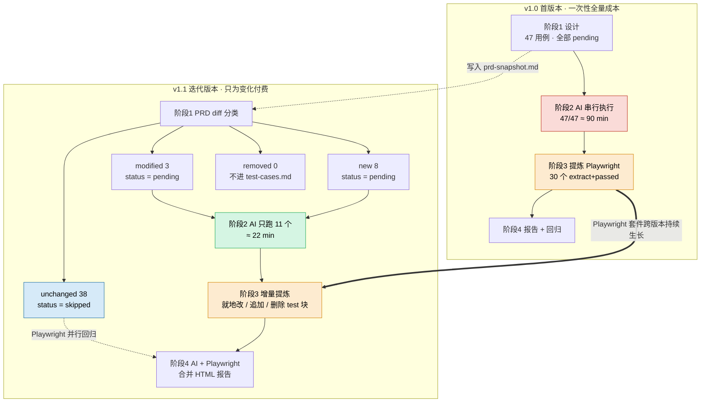

# doc2test

> 基于 PRD 的 AI 驱动 UI 自动化测试 Skill —— 同时支持 **Claude Code** 与 **Codex CLI**。

中文 | [English](./README.en.md)

一个 Skill，四个阶段，覆盖从「读 PRD」到「跑用例」再到「沉淀回归套件」的完整闭环：

1. **设计** —— 读取 PRD，在 `test/{version}/` 下生成结构化的测试大纲与用例（含 PRD 快照与版本 diff）。
2. **执行** —— 通过 `chrome-devtools-mcp` 在真实浏览器里跑用例，截图、console、网络异常逐例留证。
3. **提炼** —— 把稳定的确定性流程自动提炼为 Playwright 脚本，沉淀为跨版本复用的回归套件。
4. **回归 + 报告** —— 运行 Playwright，把 AI 执行与 Playwright 结果合并到统一的 HTML dashboard。

完整规则与不变量见 [SKILL.md](./SKILL.md)；用例设计规范见 [role.md](./role.md)。

---

## 安装

### Claude Code

**全局安装（推荐）** —— 跨所有项目可用：

```bash
git clone https://github.com/marktyo/doc2test.git ~/.claude/skills/doc2test
```

**项目级安装** —— 仅在当前项目可用、跟着仓库走：

```bash
# 在目标项目根目录
git submodule add https://github.com/marktyo/doc2test.git .claude/skills/doc2test
```

**通过 plugin marketplace（可选）** —— 适合需要版本管理与一键更新的团队：

```text
/plugin marketplace add marktyo/doc2test
/plugin install doc2test
```

### Codex CLI

**全局安装**：

```bash
git clone https://github.com/marktyo/doc2test.git ~/.codex/skills/doc2test
```

**项目级安装**：

```bash
git submodule add https://github.com/marktyo/doc2test.git .codex/skills/doc2test
```

### 双客户端共存

如果同一台机器既用 Claude Code 又用 Codex，推荐做法：clone 到一个中立位置，然后软链到两个 skills 目录：

```bash
git clone https://github.com/marktyo/doc2test.git ~/skills/doc2test
ln -s ~/skills/doc2test ~/.claude/skills/doc2test
ln -s ~/skills/doc2test ~/.codex/skills/doc2test
```

`git pull` 一次，两个客户端同时升级。

---

## 依赖

| 依赖 | 用于哪个阶段 | 备注 |
|---|---|---|
| [`chrome-devtools-mcp`](https://github.com/anthropics/chrome-devtools-mcp) | 阶段 2（执行） | 必装。需在所用客户端中注册为 MCP server |
| Node + npm/pnpm | 阶段 3、4（提炼 / 回归） | 用于运行 Playwright |
| Playwright | 阶段 4（回归） | Skill 会按需引导初始化 |

---

## 快速开始

1. 进入你的 Web 项目根目录。
2. 在 Claude Code 中输入：

   ```text
   /doc2test
   ```

   或者在 Codex 中：

   ```text
   跑一下 doc2test，版本 v1.0
   ```

3. Skill 会引导你生成 `test/.skill-config.yaml`，确认 PRD 路径、应用 URL、登录模式、模块映射等。
4. 接着按四个阶段顺序执行；每个阶段结束后向你汇报，可随时打断或重定向。

最终产物：

```text
test/
├── .skill-config.yaml          ← 项目级 skill 配置
├── accounts.md                 ← 测试账号（gitignore）
├── v1.0/
│   ├── test-outline.md
│   ├── test-cases.md
│   ├── prd-snapshot.md
│   ├── prd-diff.md             ← 仅迭代版本
│   ├── ORD_001/                ← 一个用例一个文件夹
│   │   ├── meta.json
│   │   ├── steps.md
│   │   ├── screenshots/
│   │   └── console.log
│   └── report/
│       └── index.html          ← 统一 HTML 报告
└── playwright/                 ← 跨版本共享的回归套件
    ├── playwright.config.ts
    ├── fixtures/
    └── specs/{domain}/{feature}.spec.ts
```

---

## 版本迭代流程

首版本一次性付全量成本，后续迭代只为"变化的部分"付费 —— Playwright 套件跨版本沉淀，越用越快。



**读图要点：**

- **红色** = AI 串行全量跑（贵）；**绿色** = AI 串行增量跑（便宜）；**蓝色** = 完全跳过，由 Playwright 覆盖；**橙色** = Playwright 套件沉淀点。
- **虚线** `prd-snapshot.md` 是版本间 diff 的锚点 —— v1.0 写入快照，v1.1 对照快照分类用例。
- **粗箭头**是这套设计的核心 —— Playwright 套件只在阶段 3 增长，不按版本切分，每次回归都全量跑。
- v1.1 的 `unchanged` 用例**完全不消耗 AI 时间**，但在阶段 4 仍由 Playwright 并行回归覆盖 —— 这就是迭代版本省时间的来源。

---

## 项目结构

```text
doc2test/
├── SKILL.md                    ← Skill 入口（Claude Code & Codex 都从此处读）
├── role.md                     ← 用例设计规范（公司层面统一标准）
├── workflows/                  ← 四个阶段各自的详细操作步骤
│   ├── 1-design.md
│   ├── 2-execute.md
│   ├── 3-extract.md
│   └── 4-regress.md
├── conventions/                ← 目录与命名规范
│   └── artifacts-layout.md
├── templates/                  ← 配置 / 用例 / 报告骨架
│   ├── .skill-config.yaml
│   ├── test-outline.md
│   ├── test-cases.md
│   ├── playwright.config.ts
│   ├── playwright.spec.ts
│   ├── auth.fixture.ts
│   ├── report-index.html
│   ├── report-ai-run.html
│   ├── report-assets/
│   └── meta.schema.json
├── examples/                   ← 真实项目端到端配置走例
│   └── healthcare.md
├── .claude-plugin/
│   └── plugin.json             ← Claude Code plugin 元信息
├── CHANGELOG.md
├── LICENSE
└── README.md
```

---

## FAQ

### Q1：阶段 2（执行）是串行的吗？能并行跑用例吗？

**当前是串行**，一次跑一个用例。三个根本约束：

- LLM 是顺序推理的，工具调用可以并行但「看截图 → 判断 → 决定下一步」这个推理链做不到真正并行；
- chrome-devtools-mcp 单浏览器实例 + 单一登录会话，并行执行会污染 cookie / DOM 状态；
- 截图编号、console 时间序列都假设单用例独占浏览器。

真正的并行发生在**阶段 4** —— Playwright 用 worker 原生并行回归。这就是 Skill 把 AI 执行（慢、串行）和 Playwright 回归（快、并行）拆成两个阶段的核心理由：首版承担一次性串行成本，迭代版本里 `unchanged` 用例直接跳过，绝大多数交给 Playwright 并行覆盖。

### Q2：首版本会用 AI 跑全部用例吗？

**是的，100% 全量。** 首版没有上一版快照可 diff，阶段 1 给所有用例打 `meta.status: "pending"`，阶段 2 逐个执行。

「全量 vs 增量」的概念只在迭代版本才有：阶段 1 把上一版用例分类为 `unchanged | modified | new | removed`，阶段 2 只跑 `modified | new`，`unchanged` 由阶段 4 的 Playwright 接管。

### Q3：什么样的用例会被自动提炼成 Playwright 脚本？

要同时通过**三道关卡**：

1. **阶段 1 标签为 `extract`** —— LLM 在生成用例时按 [role.md](./role.md) 第 7 节判断：
   - `extract` —— 流程稳定确定（表单校验、状态流转、列表筛选）
   - `defer` —— 业务正确但 UI 仍在迭代，下版本再判断
   - `ai-only` —— 依赖主观判断（文案清晰度、视觉一致性），永远不提炼
2. **阶段 2 AI 跑通过** —— `meta.status === "passed"`
3. **阶段 3 能干净翻译成 Playwright** —— 所有预期结果都可机器验证（URL / DOM / 网络响应），且能写出可靠的等待条件

任一关卡未过 → 下次版本仍由 AI 跑。

### Q4：举个例子，看用例如何被分流

电商场景，3 个登录用例：

| 用例 | AI 跑 | 进 Playwright | 原因 |
|---|---|---|---|
| 正确账密登录 → 跳 `/dashboard` | ✅ passed | ✅ | URL + DOM 可断言 |
| 错误密码 → 提示**清晰** | ✅ passed | ❌ | 「清晰」是主观判断，标 `ai-only` |
| 登录页**视觉一致性** | ✅ passed | ❌ | 纯视觉，标 `ai-only` |

下一版本：第一个用例由 Playwright 并行回归，AI 不再跑；后两个 PRD 没改 → `unchanged` 跳过，PRD 改了 → AI 重跑。

### Q5：测试用例列表（test-cases.md）里能看到 `playwright_strategy` 吗？

**看不到。** 它只存在于每个用例的 `meta.json`，避免污染人类可读的用例表（[role.md](./role.md) 第 8 节的约定）。

想看全局分布的方式：

- 临时聚合：`jq -r '[.id, .playwright_strategy] | @tsv' test/v1.0/*/meta.json`
- 阶段 4 生成的 `report/index.html` 可按 strategy 筛选

---

## 升级

无论安装方式，`git pull` 即可。Skill 不持有本地状态，所有产物都落在你的项目 `test/` 目录下。

---

## License

[MIT](./LICENSE)
